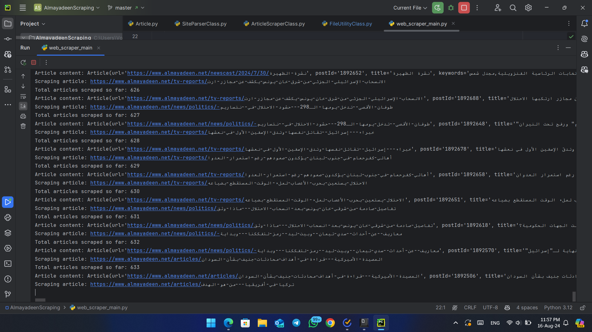

# 🌐 AlMayadeen News Scraper

[](https://www.python.org/downloads/)
[](https://opensource.org/licenses/MIT)

A powerful and efficient web scraper designed to extract and analyze articles from the AlMayadeen news website.
<div align="center">
  <a href="https://github.com/hadialshaerr"><strong>View Profile</strong></a>
    <br />
    <br />
    <a href="https://github.com/hadialshaerr/DgPad2024-DataScience-WebScraping/issues/new?labels=bug&template=bug_report.md">Report Bug</a>
    ·
    <a href="https://github.com/hadialshaerr/DgPad2024-DataScience-WebScraping/issues/new?labels=enhancement&template=feature_request.md">Request Feature</a>
  </p>
</div>

## 📋 Table of Contents

- [Overview](#-overview)
- [Key Features](#-key-features)
- [Installation Guide](#-installation)
- [Usage](#-usage)
- [Customization](#-usage)
- [Project Structure](#-project-structure)
- [Results](#-results)
- [Roadmap](#-roadmap)
- [Contributing](#-contributing)
- [Author](#-author)
- [License](#-license)

## 🔍 Overview

The AlMayadeen News Scraper is a sophisticated tool that navigates through the AlMayadeen website's sitemap, extracts valuable information from articles, and stores the data into monthly structured JSON files.
The scraper is designed to handle up to 12,000 articles efficiently.
This project aims to facilitate data analysis and research on news content from the Middle East.

## 🚀 Key Features

- **Intelligent Sitemap Parsing**: Efficiently extracts article URLs from monthly sitemaps
- **Comprehensive Article Scraping**: Captures metadata, full text, and associated media information
- **Structured Data Storage**: Organizes scraped data into year-month based JSON files
- **Robust Error Handling**: Ensures smooth operation even when encountering network issues or unexpected page structures
- **Configurable Limits**: Allows easy adjustment of scraping boundaries to suit different needs

## 🔧 Installation Guide

1. Clone the repository:
   ```
   git clone https://github.com/hadialshaerr/DgPad-DataScience-WebScraping.git
   cd DgPad-DataScience-WebScraping
   ```

2. Set up a virtual environment (optional but recommended):
   ```
   python -m venv venv
   source venv/bin/activate  # On Windows, use `venv\Scripts\activate`
   ```

3. Install required dependencies using:
   ```
   pip install -r requirements.txt
   ```
   or using pip:
   ```
   pip install requests beautifulsoup4 lxml
   ```

## 🚀 Usage

1. **Run the main script to start the scraping process:**

   ```
   python web_scraper_main.py
   ```

   This will start the process of parsing the sitemap, scraping articles, and saving the data into JSON files.

2. **Output:**

   The scraped data will be stored in the `data_articles/` directory, with each file named according to the year and month (e.g., `articles_2024_08.json`).

## Customization

- **Storage Path:** Update the directory path in `FileUtilityClass.py` to change where JSON files are stored.
- **Target Classes:** Modify `ArticleScraperClass.py` to customize which `<p>` tags or classes to scrape.

## 📁 Project Structure

```
DgPad2024-DataScience-WebScraping/
│
├── data_articles             # Folder that contains JSON files
├── Article.py                # Article data structure definition
├── ArticleScraperClass.py    # Article scraping logic
├── FileUtilityClass.py       # Data saving utilities
├── requirements.txt          # Project dependencies
├── SiteParserClass.py        # Sitemap parsing functionality
├── web_scraper_main.py       # Main execution script
└── README.md                 # Project documentation
```

## 📊 Results

Our scraper has successfully extracted a wealth of information from the AlMayadeen website. Here are some visual representations of our results:

*Execution process in the terminal*


*Total number of articles scraped*


*JSON files generated from the scraped data*


## 🛣 Roadmap

- [ ] Implement multi-threading for faster scraping
- [ ] Add support for older archive pages
- [ ] Develop a user interface for easy configuration
- [ ] Integrate with a database for more efficient storage
- [ ] Implement advanced text analysis features
- [ ] ... ... more coming soon

## 🤝 Contributing

Contributions are what make the open source community such an amazing place to learn, inspire, and create. Any contributions you make are greatly appreciated.
If you have a suggestion that would make this better, please fork the repo and create a pull request. You can also simply open an issue with the tag "enhancement".
Don't forget to give the project a star! Thanks again!

1. Fork the repository
2. Create your feature branch (`git checkout -b feature/AmazingFeature`)
3. Commit your changes (`git commit -m 'Add some AmazingFeature'`)
4. Push to the branch (`git push origin feature/AmazingFeature`)
5. Open a Pull Request

## 👤 Author

**Hadi Al-Shaer**

- GitHub: [@hadialshaerr](https://github.com/hadialshaerr)
- reach me: hadialshaerrr@gmail.com

## 📄 License

This project is open source and available under the [MIT License](LICENSE).

---

⚠️ **Disclaimer**: This scraper is intended for educational and research purposes only. Always respect the website's robots.txt file and terms of service when scraping content.
