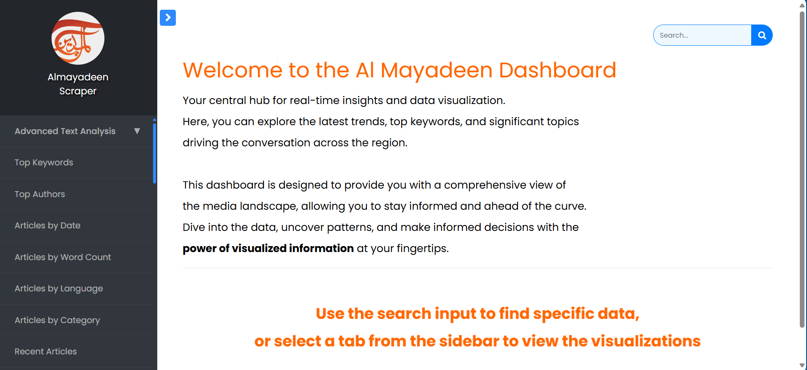

# 🌐 Interactive News Analytics Dashboard

[](https://www.python.org/downloads/)
[](https://opensource.org/licenses/MIT)

A powerful and efficient Web Scraper that extracts, analyzes, and visualizes data from the AlMayadeen news website. Utilizing advanced data analysis techniques such as sentiment analysis and entity recognition, this application dives deep into textual data to extract meaningful insights.
<div align="center">
  <a href="https://github.com/hadialshaer"><strong>View Profile</strong></a>
    <br />
    <br />
    <a href="https://github.com/hadialshaer/DataScience-NewsAnalytics/issues/new?labels=bug&template=bug_report.md">Report Bug</a>
    ·
    <a href="https://github.com/hadialshaer/DataScience-NewsAnalytics/issues/new?labels=enhancement&template=feature_request.md">Request Feature</a>
  </p>
</div>



## 📋 Table of Contents

- [Demo Video](#demo-video)
- [Detailed walkthrough videos of the News Analytics Dashboard](#detailed-walkthrough-videos-of-the-news-analytics-dashboard)
- [Overview](#-overview)
- [Key Features](#-key-features)
- [Installation Guide](#-installation-guide)
- [Usage](#-usage)
- [Customization](#customization)
- [Project Structure](#-project-structure)
- [Results](#-results)
- [Roadmap](#-roadmap)
- [Contributing](#-contributing)
- [Author](#-author)
- [License](#-license)

## Demo Video
[]()

## Detailed walkthrough videos of the News Analytics Dashboard

  - Weak_1: Extract articles, gather relevant metadata, and save this information into JSON files organized by month.

[](https://youtu.be/HgRxg2Gz0MY)

  - Weak_2: Store Data in MongoDB, and build a simple web service using Flask that allows access and analyze the data through 30 easy-to-use API endpoints.

[](https://youtu.be/VscFSu7S72A)

  - Weak_3: Visualize the data using amCharts to create interactive and visually appealing charts that help you more effectively understand the patterns and insights in the data.

[](https://youtu.be/_ZR1FFW3nMU)

  - Weak_4: Perform sentiment analysis and entity recognition using NLP libraries like CAMel Tools and AraBERT, providing deeper ‎insights into content‎

[]()

## 🔍 Overview

The Al Mayadeen News Analytics is a full-featured data analysis application that extracts valuable information from articles and visualizes it.<br>
It uses advanced data analysis techniques like sentiment analysis and entity recognition.<br>
This project aims to facilitate data analysis and research on news content from the Middle East.<br>
It extracts deeper insights from textual data and presents these insights meaningfully.

## 🚀 Key Features

- **Intelligent Sitemap Parsing**: Efficiently extracts article URLs from monthly sitemaps, ensuring comprehensive data collection from various sources.
- **Comprehensive Article Scraping**: Utilizes BeautifulSoup to capture metadata, full text, and associated media information, organizing articles effectively for analysis.
- **Structured Data Storage**: Leverages PyMongo and MongoDB to store large datasets in year-month based JSON files, optimizing for efficient retrieval and querying.
- **Flask API with Multiple Endpoints**: Provides a Flask-based API with several endpoints to access, aggregate, and analyze the scraped data in real time.
- **Interactive Data Visualization**: Integrates amCharts to create dynamic, interactive charts that visualize data trends and patterns for insightful analysis.
- **Advanced Sentiment & Entity Analysis**: Performs sentiment analysis and entity recognition using NLP tools like CAMel Tools and AraBERT, generating deeper insights into the content.
- **Responsive Interactive Dashboard**: Combines all visualizations and analytics into a responsive dashboard, providing a user-friendly interface for interacting with the data.
- **Robust Error Handling**: Ensures smooth operation even when encountering network issues or unexpected page structures, preventing disruptions in the scraping process.
- **Configurable Scraping Limits**: Allows easy adjustment of scraping boundaries, enabling flexible data collection according to different project needs.
- **Enhanced Security**: Implements API authentication to safeguard data access, ensuring that only authorized users can interact with the collected information.

## 🔧 Installation Guide

1. Clone the repository:
   ```
   git clone https://github.com/hadialshaer/DataScience-NewsAnalytics.git
   cd DataScience-NewsAnalytics
   ```

2. Set up a virtual environment (optional but recommended):
   ```
   python -m venv venv
   source venv/bin/activate  # On Windows, use `venv\Scripts\activate`
   ```

3. Install required dependencies using:
   ```
   pip install -r requirements.txt
   ```
4. Install the necessary tools and datasets for working with sentiment analysis and entity recognition on Arabic text:
   ```
   pip install camel_tools
   ```
   ```
   camel_data -i sentiment-analysis-all
   ```
   ```
   camel_data -i ner-all
   ```

## 🚀 Usage

1. **Run the main script to start the scraping process:**

   ```
   python web_scraper_main.py
   ```
   This will start the process of parsing the sitemap, scraping articles, and saving the data into JSON files.

2. **Output:**

   The scraped data will be stored in the `data_articles/`, with each file named according to the year and month (e.g., `articles_2024_08.json`).

2. **Dashboard with visualized endpoints**

   Run the `app.py` script, and open the url that refers to your local server.

2. **Enjoy the show 😉**
   
## Customization

- **Storage Path:** Update the directory path in `FileUtilityClass.py` to change where JSON files are stored.
- **Target Classes:** Modify `ArticleScraperClass.py` to customize which `<p>` tags or classes to scrape.

## 📁 Project Structure

```
InteractiveNewsAnalyticsDashboard/
│
├── data_ai_intelligence/
├── data_collection/
├── data_storage_analysis/
├── data_visualization/     
├── app.py
├── requirements.txt
```

## 📊 Results

*Execution process in the terminal*


*Total number of articles scraped*


*JSON files generated from the scraped data*


*Results in MongoDb*


*Visual Representation*<br>
Refer to the GIF at the top, or click here to view: <a href="https://github.com/hadialshaer/DataScience-NewsAnalytics/data_visualization/visualization_screenshots"><strong>View visualizations</strong></a>
## 🛣 Roadmap

- [ ] Deploy to cloud platform (e.g., AWS, Heroku, Azure, or Render)
- [ ] Integrate real-time data scraping and analysis
- [ ] Implement multi-threading for faster scraping
- [ ] Optimize data storage with advanced indexing in MongoDB for faster queries
- [ ] Implement notifications or alerts for breaking news or trending topics
- [ ] Add a scheduling system for automated, periodic scraping
- [ ] ... more coming soon


## 🤝 Contributing

Contributions are what make the open source community such an amazing place to learn, inspire, and create. Any contributions you make are greatly appreciated.
If you have a suggestion that would make this better, please fork the repo and create a pull request. You can also simply open an issue with the tag "enhancement".
Don't forget to give the project a star! Thanks again!

1. Fork the repository
2. Create your feature branch (`git checkout -b feature/AmazingFeature`)
3. Commit your changes (`git commit -m 'Add some AmazingFeature'`)
4. Push to the branch (`git push origin feature/AmazingFeature`)
5. Open a Pull Request

## 👤 Author

**Hadi Al-Shaer**

- GitHub: [@hadialshaer](https://github.com/hadialshaer)
- reach me: hadialshaerrr@gmail.com

## 📄 License

This project is open source and available under the [MIT License](LICENSE).

---

⚠️ **Disclaimer**: This scraper is intended for educational and research purposes only. Always respect the website's robots.txt file and terms of service when scraping content.
